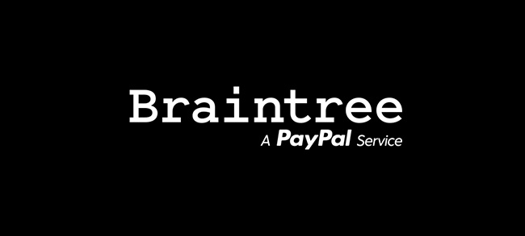
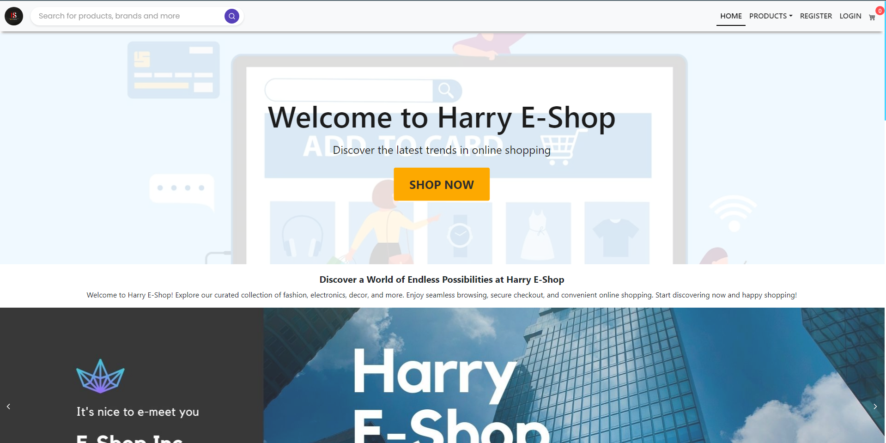

# Harry E Shopping

# Full Stack Developer: E-Commerce Website

## Overview

Welcome to my E-Commerce website project repository! This project serves as a testament to my expertise as a Full Stack Developer, highlighting my ability to create a dynamic and responsive online shopping platform. Powered by React, SASS, Bootstrap, Node.js, Express, MongoDB, and integrated with Braintree for seamless payments, it demonstrates the culmination of my skills in building robust and user-friendly web applications.

## Project Features
- :house_with_garden: Home: A visually appealing landing page that captures the essence of the e-commerce website and provides an inviting user experience.
- :package: Products: Browse through an extensive collection of products, beautifully displayed with relevant details and images.
- :mag: Product Details: Get comprehensive information about each product, including descriptions, pricing, and customer reviews.
- :bookmark_tabs: Category: Easily navigate through different product categories to find exactly what you're looking for.
- :shopping_cart: Cart: Seamlessly manage your shopping cart, add or remove products, and proceed to a secure checkout process.
- :mag_right: Search: Utilize the powerful search functionality to quickly find specific products based on keywords or filters.
- :iphone: Responsive design: Experience a seamless shopping experience on any device with responsive design.
- :bald_man: Streamlined Admin Dashboard: Empower yourself with our intuitive and efficient Admin Dashboard for effortless management and control.
- :busts_in_silhouette: User Dashboard: Personalize your shopping experience and stay in control with our user-friendly dashboard.

## Technologies Used
- Frontend:  React,
   SCSS,
   Bootstrap (Navbar)
- Backend:  Node.js,
   Express.js
- Database:  MongoDB
- Payment Integration:  Braintree

## Technologies
-  React: A popular JavaScript library for building user interfaces.
-  Node.js: A runtime environment for executing JavaScript code server-side.
-  Express: A fast and minimalist web application framework for Node.js.
-  MongoDB: A flexible and scalable NoSQL database for storing product and user data.
-  Braintree: A robust payment gateway for secure and hassle-free transactions.
-  SCSS: A powerful CSS preprocessor for creating organized and maintainable styles.
-  Bootstrap: A responsive and feature-rich CSS framework for building modern websites.

## Screenshot 

[See Live website](https://harry-e-shopping.cyclic.app/)

## Contact

For any inquiries or job opportunities, feel free to reach out to me at [Linkedin](https://www.linkedin.com/in/hariomtomar). Let's connect and discuss how my skills can contribute to your organization's success.

<!-- ## Technologies Used
- Frontend:  React,  SCSS,  Bootstrap (Navbar)
- Backend:  Node.js,  Express.js
- Database:  MongoDB
- Payment Integration:  Braintree

## Technologies
-  React: A popular JavaScript library for building user interfaces.
-  Node.js: A runtime environment for executing JavaScript code server-side.
-  Express: A fast and minimalist web application framework for Node.js.
-  MongoDB: A flexible and scalable NoSQL database for storing product and user data.
-  Braintree: A robust payment gateway for secure and hassle-free transactions.
-  SCSS: A powerful CSS preprocessor for creating organized and maintainable styles.
-  Bootstrap: A responsive and feature-rich CSS framework for building modern websites. -->

<!-- <a href="https://harry-e-shopping.cyclic.app/">click</a> -->

<!-- ## Why Hire Me?
- Full Stack Expertise: I possess a strong command over both frontend and backend development, enabling me to create seamless and efficient web applications.
- Attention to Detail: I have meticulously designed and developed this project, ensuring an intuitive user interface and smooth user experience.
- Responsive Design: The website is fully responsive, adapting flawlessly to various devices, including desktops, tablets, and mobile phones.
- Clean Code: I follow best practices and write clean, modular, and well-documented code, making the project maintainable and scalable.
- Passion for Problem-Solving: I thrive on challenging tasks and enjoy finding innovative solutions to complex problems.
- Collaborative Nature: I am a team player and work effectively in both independent and collaborative environments. -->

<!-- 
## Contact

For any inquiries or job opportunities, feel free to reach out to me at [Linkedin](https://www.linkedin.com/in/hariomtomar). Let's connect and discuss how my skills can contribute to your organization's success. -->
